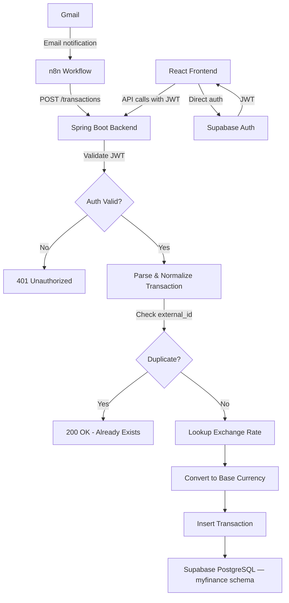

# ⚠️ OBSOLETO — archivado 2026-05-13

> **Fuente de verdad actual del modelo de datos:** [`SPEC.md` §4](../SPEC.md) (raíz del repo) más el detalle por épica/tarea en la [página Notion del proyecto](https://www.notion.so/35d8c9b709f081c08d62f7257ce3db57) (TASK-DB-01..05) y el plan de la nueva épica de Metas de Ahorro en [`plans/savings-goals-plan.md`](../plans/savings-goals-plan.md) (TASK-SG-DB-01..03).
>
> **Razón del archivo:** este documento describe el **baseline V001–V003** del schema `myfinance`, que ya fue aplicado a Supabase, pero **no incluye** los campos y tablas decididas posteriormente:
> - `categories.display_name` (TASK-DB-01)
> - `transactions.installments_total`, `installment_number`, `parent_transaction_id` (TASK-DB-02)
> - `accounts.cut_day`, `payment_day` (TASK-DB-03)
> - tabla `merchants` (TASK-DB-04)
> - `transactions.merchant_id`, `ai_suggested_category_id`, `categorization_confidence`, `category_confirmed` (TASK-DB-05)
> - tablas `savings_goals` y `savings_goal_contributions` (TASK-SG-DB-01)
>
> Se mantiene únicamente como referencia histórica del baseline aplicado.

---

# Database Model Plan — MyFinanceView

## 1. Overview

This document details the complete database schema for MyFinanceView, including DDL, indexes, RLS policies, and seed data. The database is hosted on **Supabase (PostgreSQL)** and uses **Supabase Auth** for user management.

All application tables, types, and functions live under the **`myfinance`** schema to isolate them from Supabase system schemas (`auth`, `storage`, `public`).

---

## 2. Changes & Improvements from agents.md

### 2.1 New Tables Added

| Table | Reason |
|---|---|
| `myfinance.user_settings` | Per-user base currency, timezone, and locale configuration |
| `myfinance.categories` | System defaults + user-custom transaction categories |
| `myfinance.budget_categories` | Per-category budget allocations within a monthly budget |

### 2.2 Improvements to Existing Tables

| Table | Change | Reason |
|---|---|---|
| `myfinance.banks` | Added `code` column | Short identifier for programmatic matching during email parsing |
| `myfinance.accounts` | Added `nickname`, `updated_at` | User-friendly display name; audit trail |
| `myfinance.transactions` | Added `category_id` FK, `updated_at`, `notes` | Categorization support; audit trail; user annotations |
| `myfinance.budgets` | Added `updated_at`; unique constraint on user+month+year | Audit trail; prevent duplicate budgets |
| `myfinance.exchange_rates` | Unique constraint on base+target+date | Prevent duplicate rates |

### 2.3 Design Decisions

1. **Custom `myfinance` schema** — All tables, ENUMs, and functions live under `myfinance.*` for clean isolation from Supabase system schemas.
2. **`user_id` denormalized into `budget_categories`** — Supabase RLS performs better with direct `user_id` checks rather than JOIN-based subqueries.
3. **Categories use a hybrid model** — System categories have `user_id = NULL` and are readable by all; user-custom categories are scoped by `user_id`.
4. **All timestamps use `timestamptz`** — Stored in UTC per the agents.md requirement.
5. **`updated_at` auto-updated via trigger** — Using a reusable trigger function in `myfinance` schema.
6. **`numeric(18,2)` for all monetary values** — PostgreSQL `numeric` maps to Java `BigDecimal` naturally, ensuring financial precision. Exchange rates use `numeric(18,8)` for precision.
7. **Transaction amounts are always positive** — The `transaction_type` enum determines the direction. This simplifies aggregation queries.
8. **Partial unique index on `external_id`** — Only non-NULL values are enforced unique, allowing manual transactions without external IDs.

---

## 3. Entity Relationship Diagram

```mermaid
erDiagram
    AUTH_USERS ||--o| USER_SETTINGS : has
    AUTH_USERS ||--o{ ACCOUNTS : owns
    AUTH_USERS ||--o{ TRANSACTIONS : creates
    AUTH_USERS ||--o{ BUDGETS : sets
    AUTH_USERS ||--o{ CATEGORIES : customizes

    BANKS ||--o{ ACCOUNTS : provides

    ACCOUNTS ||--o{ TRANSACTIONS : contains

    CATEGORIES ||--o{ TRANSACTIONS : classifies
    CATEGORIES ||--o{ BUDGET_CATEGORIES : allocated_in

    BUDGETS ||--o{ BUDGET_CATEGORIES : breaks_into

    BANKS {
        uuid id PK
        text name
        text code UK
        timestamptz created_at
    }

    USER_SETTINGS {
        uuid id PK
        uuid user_id FK_UK
        text base_currency
        text timezone
        text locale
        timestamptz created_at
        timestamptz updated_at
    }

    ACCOUNTS {
        uuid id PK
        uuid user_id FK
        uuid bank_id FK
        account_type type
        text currency
        text last4
        text nickname
        boolean active
        timestamptz created_at
        timestamptz updated_at
    }

    CATEGORIES {
        uuid id PK
        uuid user_id FK
        text name
        category_type type
        text icon
        text color
        boolean is_active
        timestamptz created_at
        timestamptz updated_at
    }

    TRANSACTIONS {
        uuid id PK
        uuid user_id FK
        uuid account_id FK
        uuid category_id FK
        transaction_type type
        numeric amount
        text currency
        numeric amount_base_currency
        text description
        text notes
        timestamptz occurred_at
        transaction_source source
        text external_id UK
        jsonb raw_payload
        timestamptz created_at
        timestamptz updated_at
    }

    BUDGETS {
        uuid id PK
        uuid user_id FK
        int month
        int year
        numeric total_budget
        text currency
        timestamptz created_at
        timestamptz updated_at
    }

    BUDGET_CATEGORIES {
        uuid id PK
        uuid user_id FK
        uuid budget_id FK
        uuid category_id FK
        numeric allocated_amount
        timestamptz created_at
        timestamptz updated_at
    }

    EXCHANGE_RATES {
        uuid id PK
        text base_currency
        text target_currency
        numeric rate
        date effective_date
        timestamptz created_at
    }
```

---

## 4. RLS Strategy

### 4.1 Principles

- All tables have RLS **enabled**
- `auth.uid()` is used to scope user-owned data
- System tables (`myfinance.banks`, `myfinance.exchange_rates`) are read-only for authenticated users, write-only for service role
- The Spring Boot backend connects via **service_role** or direct PostgreSQL, which bypasses RLS — but RLS provides defense-in-depth and protects against direct Supabase client access from the frontend

### 4.2 Policy Summary

| Table | SELECT | INSERT | UPDATE | DELETE |
|---|---|---|---|---|
| `myfinance.banks` | All authenticated | Service role only | Service role only | Service role only |
| `myfinance.user_settings` | Own rows | Own rows | Own rows | Own rows |
| `myfinance.categories` | System OR own | Own only | Own only | Own only |
| `myfinance.accounts` | Own rows | Own rows | Own rows | Own rows |
| `myfinance.transactions` | Own rows | Own rows | Own rows | Own rows |
| `myfinance.budgets` | Own rows | Own rows | Own rows | Own rows |
| `myfinance.budget_categories` | Own rows | Own rows | Own rows | Own rows |
| `myfinance.exchange_rates` | All authenticated | Service role only | Service role only | Service role only |

---

## 5. Indexes Strategy

| Table | Index | Type | Reason |
|---|---|---|---|
| `myfinance.transactions` | `external_id` | UNIQUE PARTIAL | Idempotent ingestion |
| `myfinance.transactions` | `user_id, occurred_at DESC` | BTREE | Dashboard time-range queries |
| `myfinance.transactions` | `user_id, type` | BTREE | Type-filtered aggregations |
| `myfinance.transactions` | `account_id` | BTREE | Account-scoped queries |
| `myfinance.transactions` | `category_id` | BTREE PARTIAL | Category-based reports |
| `myfinance.accounts` | `user_id` | BTREE | User account listing |
| `myfinance.budgets` | `user_id, year, month` | UNIQUE | One budget per user per month |
| `myfinance.budget_categories` | `budget_id, category_id` | UNIQUE | One allocation per category per budget |
| `myfinance.exchange_rates` | `base, target, date` | UNIQUE | One rate per pair per day |
| `myfinance.exchange_rates` | `base, target, date DESC` | BTREE | Rate lookup queries |
| `myfinance.categories` | `user_id` | BTREE PARTIAL | User category listing |

---

## 6. Data Flow Diagram



---

## 7. Notes for Backend Integration

- Spring Boot JPA entities should map `numeric` → `BigDecimal`
- `timestamptz` → `OffsetDateTime`
- `uuid` → `UUID`
- ENUMs can be mapped via `@Enumerated(EnumType.STRING)` with Hibernate PostgreSQL dialect for native enums
- The `raw_payload` JSONB column maps to a `String` or custom JSON type via `@JdbcTypeCode(SqlTypes.JSON)`
- RLS is bypassed by the backend service role connection — enforce user scoping in the application layer
- Spring Boot `application.yml` should set `spring.jpa.properties.hibernate.default_schema=myfinance`

---

## 8. Migration Files

| File | Description |
|---|---|
| [`database/migrations/V001__initial_schema.sql`](database/migrations/V001__initial_schema.sql) | Schema creation, ENUMs, tables, constraints, indexes, triggers |
| [`database/migrations/V002__rls_policies.sql`](database/migrations/V002__rls_policies.sql) | All RLS policies for all 8 tables |
| [`database/migrations/V003__seed_data.sql`](database/migrations/V003__seed_data.sql) | Default categories (19) and Colombian banks (10) |
